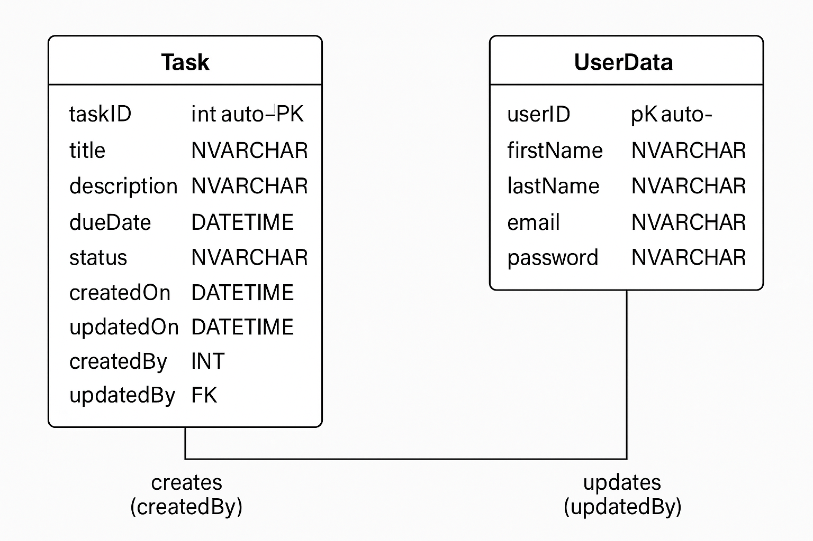

# 📝 Task Management System

## 📌 Overview
The Task Management System is a Single‑Page Application (SPA) built to demonstrate full CRUD functionality (Create, Read, Update, Delete, Search) within an enterprise‑grade MVC architecture. It enables registered users to create and manage tasks with metadata such as due date, status, remarks and audit timestamps.

---

## 📂 Tech Stack
- **Frontend:** React 19 (SPA)  
- **Backend:** ASP.NET Core 8 MVC / Web API  
- **Database:** Microsoft SQL Server 2019+  
- **Version Control:** Git (GitHub)  
- **Testing & API Tools:** Postman  
- **IDE:** Visual Studio 2022 / VS Code  

---

## 🗃️ Database Design
### 📊 ER Diagram

The following ER diagram illustrates the relationship between the `Task` and `UserData` tables:




### 📖 Data Dictionary

| Column      | Data Type       | Description                                      |
|-------------|-----------------|--------------------------------------------------|
| taskID      | INT             | Primary key, auto‑increment                      |
| title       | NVARCHAR(MAX)   | Task title                                       |
| description | NVARCHAR(MAX)   | Detailed description                             |
| dueDate     | DATETIME        | Task due date                                    |
| status      | NVARCHAR(50)    | Current status (e.g., Pending, Completed)        |
| remarks     | NVARCHAR(MAX)   | Optional comments                                |
| createdOn   | DATETIME        | Timestamp when task was created                  |
| updatedOn   | DATETIME NULL   | Timestamp when task was last updated             |
| createdBy   | INT             | FK to userData.userID (creator)                  |
| updatedBy   | INT NULL        | FK to userData.userID (last updater)             |

| Column      | Data Type       | Description                                      |
|-------------|-----------------|--------------------------------------------------|
| userID      | INT             | Primary key, auto‑increment in userData table    |
| firstName   | NVARCHAR(50)    | User’s first name                                |
| lastName    | NVARCHAR(50)    | User’s last name                                 |
| email       | NVARCHAR(50)    | User’s email                                     |
| password    | NVARCHAR(50)    | User’s password (hashed/stored securely)         |

### ⚙️ Indexes
- **PK_taskData** on `taskID`  
- **PK_userData** on `userID`  
- Non‑clustered indexes on `createdBy`, `updatedBy`, and `status` for efficient lookups  

---

## 🧱 Application Structure

### 🔄 Architecture
- **Frontend (SPA):** React components communicate with backend via Axios/Fetch  
- **Backend (API):** ASP.NET Core controllers invoke stored procedures for data access  
- **Database:** SQL Server stores task and user data; stored procedures handle CRUD  

### 🖼️ Frontend
- **Components:**  
  - `Login.jsx` / `Register.jsx`  
  - `Navbar.jsx`  
  - `Home.jsx` (task list & search)  
  - `Task.jsx` (task card)  
  - `ViewTask.jsx` (detailed view)  
- **Routing:** React Router v6  
- **State Management:** React hooks (`useState`, `useEffect`)  

### ⚙️ Backend
- **Controllers:**  
  - `taskController` (endpoints: UpsertTask, GetTaskById, SearchTasks, DeleteTask)  
  - `userController` (endpoints: Register, Login)  
- **Stored Procedures:**  
  - `spCreateUser`, `spValidateLogin`  
  - `UpsertTask`, `usp_GetTaskById`, `usp_SearchTasks`  
- **Error Handling:** TRY/CATCH in SQL, exception filters in ASP.NET  

---

## ⚒️ Setup Instructions

### 🖥️ Prerequisites
- .NET 8 LTS SDK  
- SQL Server 2019+  
- Visual Studio 2022 and VS Code  

### 🏗️ Build & Install

```bash

# 1. Frontend
Fetch the zip file provided
npm install
npm run dev

# 2. Backend
Fetch the zip file provided
Run .sln file in the folder
Place your database server name in appsettings.json

# 3. Database
Run script file in SQL Server


